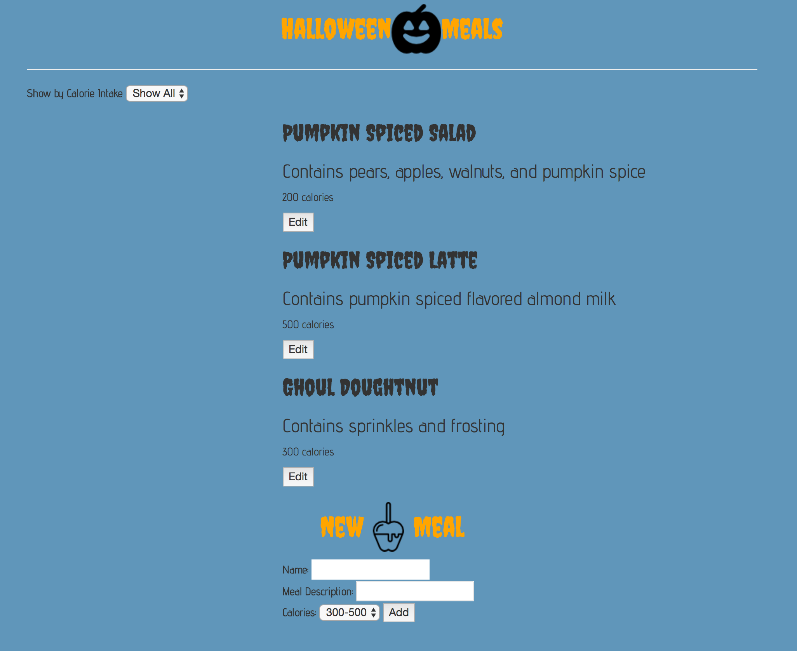

# _Mega Meal Tracker_

#### _Mega Meal Tracker Epicodus Week 2: JavaScript Angular 2 Solo Project_

#### By _**Megan Kaluza**_

## Description

_Objectives:_

* _Is the app structured in a logical way, including a model, multiple components and TypeScript?_

* _Can the application create and edit new instances of a model?_

* _Does the app allow you to view a list of foods?_

* _Can the application filter foods based on their calories?_

* _Are dependencies managed with npm and Bower?_

* _Does the app include a gulp-based asset pipeline with a development server?_

* _Is the project in a presentable, portfolio-quality state?_

## Setup/Installation Requirements

* _Clone this repository_
    * _To clone using Git, use the following terminal command:_
    _https://github.com/megankaluza/meal-tracker.git_
* _Open in text editor of your choice_
* _Open command line:_
* _npm install_
* _bower install_
* _gulp build_
* _gulp serve_

## Known Bugs

_No known bugs at this time_

## Support and contact details

## Technologies Used

* _HTML_
* _CSS_
* _Bootstrap_
* _jQuery_
* _JavaScript_

### License

Copyright (c) 2016 **_Megan Kaluza_**

This software is licensed under the MIT license.

Permission is hereby granted, free of charge, to any person obtaining a copy of this software and associated documentation files (the "Software"), to deal in the Software without restriction, including without limitation the rights to use, copy, modify, merge, publish, distribute, sublicense, and/or sell copies of the Software, and to permit persons to whom the Software is furnished to do so, subject to the following conditions:

The above copyright notice and this permission notice shall be included in all copies or substantial portions of the Software.

THE SOFTWARE IS PROVIDED "AS IS", WITHOUT WARRANTY OF ANY KIND, EXPRESS OR IMPLIED, INCLUDING BUT NOT LIMITED TO THE WARRANTIES OF MERCHANTABILITY, FITNESS FOR A PARTICULAR PURPOSE AND NONINFRINGEMENT. IN NO EVENT SHALL THE AUTHORS OR COPYRIGHT HOLDERS BE LIABLE FOR ANY CLAIM, DAMAGES OR OTHER LIABILITY, WHETHER IN AN ACTION OF CONTRACT, TORT OR OTHERWISE, ARISING FROM, OUT OF OR IN CONNECTION WITH THE SOFTWARE OR THE USE OR OTHER DEALINGS IN THE SOFTWARE.
